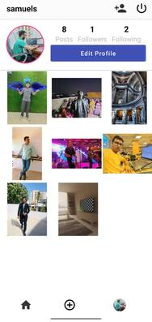

### Instagram Clone App - Firebase | Kotlin Coroutines | MVVM 
#####      Developed by Developer Samuel Akram © Follow me on instagram @samuelcodes or email me: dev.samakram@gmail.com

##### YouTube Tutorial: https://www.youtube.com/watch?v=Jk0ysdgE-AQ&list=PLKETiCsEsH0qat2OeP9KB5UmnVGN_sjwB

#### Demo


#### Firebase Firestore Structure 

        ```
     `     Collection: Users
               documentid: userid // the user who is loggedin
     
          Collection: Posts
               documentid: postid // a random id generated with the help of UUID
           
            each post has a field that contains the list as value, this list contains 
            the usersids of users who have liked the post. 
     
          Collection: Follow
                 documentid: userid // the user who is loggedin
                       followingid: List of users I follow
          
          ```

#### I have used the following tech 

1. Navigation components 
2. Kotlin coroutines
3. MVVM
4. Recyclerview
5. Firebase,Firestore, Firebasestorage


### Images

### Login Screen


### Profile fragment 


### Follow Fragment


### FeedView 


### Edit Profile 


### Upload post 


